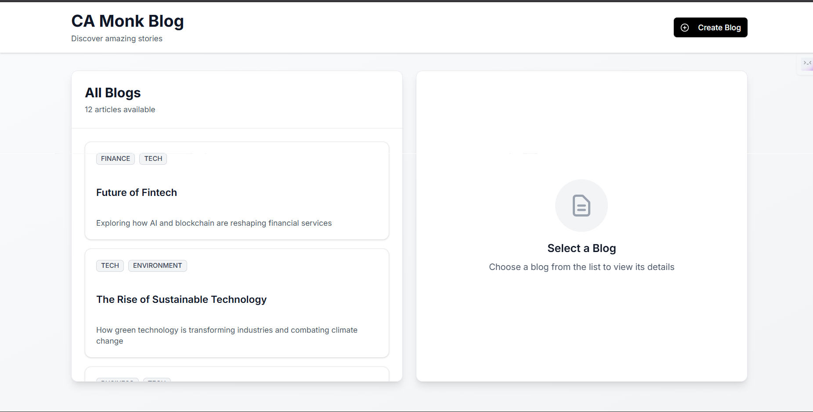

# CA Monk - Blog Application Assignment

Welcome to the CA Monk Blog Application assignment! This project tests your ability to build a modern React application with state management, styling, and component libraries.

## 📸 Screenshots of Working model

Blog List Dashboard
*Figure 1: Blog dashboard view with category filtering and blog list.*

Create Blog Modal
*Figure 2: Create new blog modal with form validation.*

---

## 🛠️ Installation

### Prerequisites
- **Node.js**: v18 or higher
- **Git**
- **React.js**: Knowledge of functional components and hooks
- **Tech Stack**: TanStack Query, Tailwind CSS, shadcn/ui

### Setup Instructions

1. **Clone the repository**
   ```bash
   git clone <repository-url>
   cd camonk-interview
   ```

2. **Install dependencies**
   ```bash
   npm install
   ```

3. **Start the JSON Server (Backend API)**
   ```bash
   npm run server
   ```
   *The API will run on `http://localhost:3001`*

4. **Start the Development Server (Frontend)**
   Open a new terminal and run:
   ```bash
   npm run dev
   ```
   *The app will run on `http://localhost:5173`*

---

## 📋 Assignment Tasks

You are required to build a blog application with the following features:

### Required Technologies
- ✅ **TanStack Query** - For server state management and data fetching ([Docs](https://tanstack.com/query/latest))
- ✅ **Tailwind CSS** - For styling ([Docs](https://tailwindcss.com/))
- ✅ **shadcn/ui** - For UI components ([Docs](https://ui.shadcn.com/))

### UI Reference
The application layout consists of:
- **Left Panel**: Blog list view showing blog cards with category, title, and description.
- **Right Panel**: Blog detail view displaying cover image and full content.
- **Blog Content**: Use plain text (no HTML-formatted text required).

---

## 📝 Tasks to Complete

### 1. Get All Blogs
- Create a component to display all blogs using `GET /blogs`.
- Use **TanStack Query** for data fetching.
- Handle **loading** and **error** states.

### 2. Get Blog by ID
- Implement single blog view using `GET /blogs/:id`.
- Use **TanStack Query** for data fetching.

### 3. Create a New Blog
- Build a form to create a new blog using `POST /blogs`.
- Invalidate queries after successful creation to refresh the list.
- Organize your components in a suitable file structure within the `src/` directory.

---

## 🔌 API Endpoints

The JSON Server provides the following endpoints:

| Method | Endpoint | Description |
| :--- | :--- | :--- |
| **GET** | `/blogs` | Get all blogs |
| **GET** | `/blogs/:id` | Get a specific blog by ID |
| **POST** | `/blogs` | Create a new blog |

---

## 📄 Sample Blog Object

```json
{
  "id": 1,
  "title": "Future of Fintech",
  "category": ["FINANCE", "TECH"],
  "description": "Exploring how AI and blockchain are reshaping financial services",
  "date": "2026-01-11T09:12:45.120Z",
  "coverImage": "https://images.pexels.com/photos/6801648/pexels-photo-6801648.jpeg",
  "content": "Full blog content..."
}
```

---